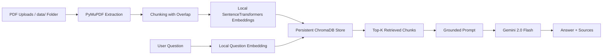

# Enterprise Knowledge Assistant

Enterprise Knowledge Assistant is a local-first retrieval augmented generation (RAG) app for asking questions over PDF documents. It uses Streamlit for the UI, PyMuPDF for PDF parsing, SentenceTransformers for local embeddings, ChromaDB for persistence, and Gemini 2.0 Flash for response generation.


## What It Does
> Built as an AI Engineer assignment demonstrating production-quality 
> RAG system design with local embeddings, persistent vector search, 
> hallucination prevention, and source citations.
- Upload one or more PDFs from the UI or place them in `data/`.
- Extract page-aware text from PDFs with PyMuPDF.
- Chunk documents into overlapping segments for retrieval.
- Embed text locally with `sentence-transformers/all-MiniLM-L6-v2`.
- Persist chunks and metadata in ChromaDB.
- Answer questions with grounded responses and source citations.
- Refuse to answer when the context is not in the uploaded documents.

## How to Run the Application

### 1. Create and activate a virtual environment

```powershell
python -m venv venv
.\venv\Scripts\Activate.ps1
```

### 2. Install dependencies

```powershell
pip install -r requirements.txt
```

### 3. Configure the Gemini API key

Create a `.env` file in the project root:

```dotenv
GOOGLE_API_KEY=your_google_api_key_here
```

### 4. Start the app

```powershell
streamlit run app.py
```

Then open the local URL shown in the terminal, usually `http://localhost:8501`.

### 5. Use the app

1. Upload PDFs in the sidebar or copy them into `data/`.
2. Click `Process uploaded PDFs` or `Reindex PDFs in data/`.
3. Ask a question in the main panel.
4. Review the answer and the cited source document/page numbers.

## Architecture Diagram



## Technical Decisions

- Flat project layout: the app is intentionally kept at the repository root to reduce setup complexity for a small assignment-sized RAG system.
- Local embeddings: SentenceTransformers runs locally so document indexing and retrieval do not depend on external embedding APIs.
- Persistent vector storage: ChromaDB stores chunks and metadata on disk in `chroma_db/`, so the index survives restarts.
- Page-level ingestion: PDFs are extracted page by page so source references can point back to a specific page.
- Strict grounding: the prompt and app logic enforce the refusal message `Information not found in the uploaded documents.` when the context is missing.
- Gemini as generation layer: Gemini is used only for final answer generation, while retrieval stays local.
- Resilient demo behavior: the app includes a grounded fallback so a temporary Gemini quota failure does not block the live experience.

## Known Limitations

- The app only supports PDFs with extractable text; scanned PDFs without OCR will not produce useful results.
- The first run can be slow because the embedding model must be downloaded locally.
- Gemini requests depend on the configured Google API key and available quota.
- Retrieval quality depends on the wording of the question and the content density of the source PDFs.
- The system is designed for local document sets, not large-scale production indexing.
- Chroma telemetry warnings may appear on Windows, but they do not block the app.

## Project Structure

```text
enterprise-knowledge-assistant/
├── app.py
├── ingest.py
├── rag.py
├── utils.py
├── e2e_test.py
├── README.md
├── system_design.md
├── requirements.txt
├── .env.example
├── .gitignore
├── data/              ← PDFs go here
├── chroma_db/         ← persistent vector store
└── venv/              ← local virtual environment
```

## Smoke Test
## Tech Stack

| Layer | Technology |
|---|---|
| UI | Streamlit |
| PDF Parsing | PyMuPDF |
| Embeddings | sentence-transformers/all-MiniLM-L6-v2 |
| Vector Store | ChromaDB |
| LLM | Google Gemini 2.0 Flash |
| Framework | LangChain |
| Language | Python 3.12 |
Run the repository smoke test to validate ingestion, retrieval, and refusal behavior:

```powershell
.\venv\Scripts\python.exe e2e_test.py
```

## Notes

- `app.py` provides the Streamlit UI and document upload flow.
- `ingest.py` loads PDFs, preserves page metadata, chunks text, embeds it locally, and writes to ChromaDB.
- `rag.py` retrieves context, builds the prompt, and returns grounded answers.
- `utils.py` contains validation, logging, and error formatting helpers.
