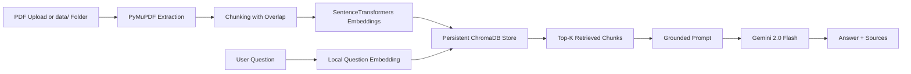

# System Design

## Overview

Enterprise Knowledge Assistant is a flat, local-first retrieval augmented generation system built with Streamlit, LangChain, ChromaDB, SentenceTransformers, PyMuPDF, python-dotenv, and Gemini 2.0 Flash.

The system is organized around three main flows:

1. Document ingestion from uploaded PDFs or PDFs already placed in `data/`.
2. Retrieval of relevant chunks from persistent ChromaDB storage.
3. Response generation with Gemini using only retrieved document context.

## Components

### `app.py`

The Streamlit UI handles:

- Loading the `GOOGLE_API_KEY` from `.env`.
- Uploading multiple PDFs into `data/`.
- Triggering ingestion from uploaded files or from `data/`.
- Accepting user questions.
- Displaying answers and source metadata.
- Showing user-facing validation and runtime errors.

### `ingest.py`

The ingestion pipeline handles:

- Validating PDF files.
- Extracting page-aware text using PyMuPDF.
- Cleaning extracted text.
- Splitting pages into overlapping chunks of 500 characters with 50 characters of overlap.
- Embedding chunks locally with `sentence-transformers/all-MiniLM-L6-v2`.
- Persisting chunks, embeddings, and metadata into ChromaDB.

### `rag.py`

The retrieval and generation layer handles:

- Loading the persistent ChromaDB collection.
- Embedding the user question locally with the same sentence-transformer model.
- Retrieving the most relevant chunks.
- Building a grounded prompt that constrains Gemini to the retrieved context.
- Calling Gemini 2.0 Flash through `google-generativeai`.
- Returning the exact refusal message when the context is missing.

### `utils.py`

Shared helper responsibilities:

- Creating application loggers.
- Validating API keys, questions, and PDF files.
- Ensuring runtime directories exist.
- Normalizing exceptions into readable user-facing messages.

## Data Flow



### Ingestion Flow

1. The user uploads PDFs or copies them into `data/`.
2. The app saves uploaded files into `data/`.
3. `ingest.py` validates each file and extracts page-level text.
4. Text is chunked with overlap so responses can cite precise passages.
5. Chunks are embedded locally.
6. ChromaDB persists the chunks and embeddings under `chroma_db/`.

### Question Answering Flow

1. The user submits a question in the Streamlit UI.
2. `rag.py` validates the question and embeds it locally.
3. ChromaDB returns the most similar chunks.
4. A prompt is built with strict grounding instructions.
5. Gemini generates the response.
6. The UI displays the answer and source document plus page number.

## Error Handling

The implementation handles the required failure cases explicitly:

- Missing or invalid API key: validation fails before answering.
- Invalid or empty PDF: ingestion rejects the file.
- Empty question input: the UI and RAG layer block the request.
- ChromaDB read/write failures: wrapped and surfaced as readable runtime errors.
- Embedding failures: surfaced as embedding-specific runtime errors.
- Gemini API failures: surfaced as generation failures.
- No documents ingested yet: retrieval and ingestion both return a clear message.

## Refusal Policy

If retrieved context does not support an answer, the assistant must return exactly:

```text
Information not found in the uploaded documents.
```

This is enforced in the prompt and also in the application logic so the system does not hallucinate a response.

## Persistence

ChromaDB is used as a local persistent vector store:

- Collection name: `enterprise_knowledge_assistant`
- Persistence directory: `chroma_db/`
- Embeddings: local SentenceTransformers vectors

Uploaded PDFs are stored in `data/`, so the app can reindex them without requiring the user to upload again.

## Validation Strategy

The repository uses a root-level smoke test in `e2e_test.py` to validate the main path end to end:

- Create a temporary PDF.
- Ingest it into an isolated temporary ChromaDB store.
- Verify grounded retrieval.
- Verify the refusal behavior when no context is available.

This keeps validation local and reproducible without requiring Docker or paid infrastructure.
